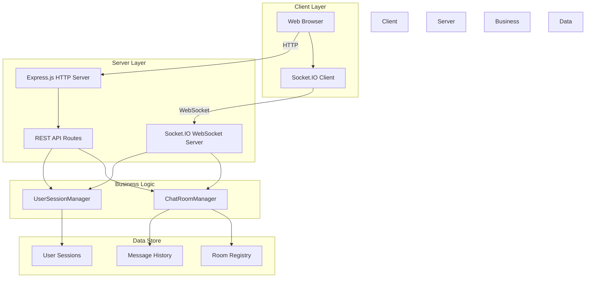
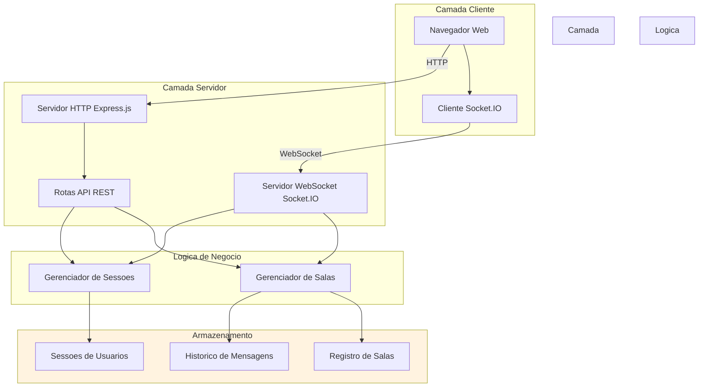

# JavaScript Chat App

<div align="center">


</div>


Real-time chat application built with Node.js, Express, and Socket.IO featuring WebSocket communication, room management, and message history.

[English](#english) | [Portugues](#portugues)

---

## English

### Overview

A real-time chat application that provides instant messaging through WebSocket connections. Features include multi-room support, user session management, message persistence, typing indicators, and a REST API for room and user querying.

### Architecture


```mermaid
graph TB
    subgraph Client Layer
        A[Web Browser]
        B[Socket.IO Client]
    end

    subgraph Server Layer
        C[Express.js HTTP Server]
        D[Socket.IO WebSocket Server]
        E[REST API Routes]
    end

    subgraph Business Logic
        F[ChatRoomManager]
        G[UserSessionManager]
    end

    subgraph Data Store
        H[Room Registry]
        I[User Sessions]
        J[Message History]
    end

    A --> B
    B -->|WebSocket| D
    A -->|HTTP| C
    C --> E
    D --> F
    D --> G
    E --> F
    E --> G
    F --> H
    F --> J
    G --> I

    style Client Layer fill:#e1f5fe
    style Server Layer fill:#f3e5f5
    style Business Logic fill:#e8f5e9
    style Data Store fill:#fff3e0
```

### Features

- WebSocket-based real-time messaging with Socket.IO
- Multi-room chat support with room creation
- User registration and session management
- Message history with configurable buffer size
- Typing indicators for active users
- REST API for room listing, user querying, and message retrieval
- Health check endpoint for monitoring
- CORS configuration support

### Quick Start

#### Prerequisites

- Node.js 18+
- npm

#### Installation

```bash
git clone https://github.com/galafis/JavaScript-Chat-App.git
cd JavaScript-Chat-App
npm install
```

#### Running

```bash
# Development
npm run dev

# Production
npm start
```

### API Endpoints

| Method | Endpoint | Description |
|--------|----------|-------------|
| GET | /api/health | Server health check |
| GET | /api/rooms | List all chat rooms |
| GET | /api/users | List online users |
| GET | /api/rooms/:id/messages | Get room message history |

### WebSocket Events

| Event | Direction | Description |
|-------|-----------|-------------|
| register | Client -> Server | Register username |
| join_room | Client -> Server | Join a chat room |
| send_message | Client -> Server | Send message to room |
| typing | Client -> Server | Typing indicator |
| new_message | Server -> Client | Broadcast new message |
| user_joined | Server -> Client | User joined notification |
| user_left | Server -> Client | User left notification |

### Project Structure

```
JavaScript-Chat-App/
├── index.js           # Main server with WebSocket handling
├── index.html         # Landing page
├── public/            # Static assets
├── docs/              # Documentation
├── examples/          # Usage examples
├── package.json
└── README.md
```

### Tech Stack

| Technology | Purpose |
|------------|---------|
| Node.js | Runtime environment |
| Express.js | HTTP server framework |
| Socket.IO | WebSocket communication |

### License

MIT License - see [LICENSE](LICENSE) for details.

### Author

**Gabriel Demetrios Lafis**
- GitHub: [@galafis](https://github.com/galafis)
- LinkedIn: [Gabriel Demetrios Lafis](https://linkedin.com/in/gabriel-demetrios-lafis)

---

## Portugues

### Visao Geral

Aplicacao de chat em tempo real que fornece mensagens instantaneas atraves de conexoes WebSocket. Inclui suporte a multiplas salas, gerenciamento de sessoes de usuarios, persistencia de mensagens, indicadores de digitacao e uma API REST para consulta de salas e usuarios.

### Arquitetura


```mermaid
graph TB
    subgraph Camada Cliente
        A[Navegador Web]
        B[Cliente Socket.IO]
    end

    subgraph Camada Servidor
        C[Servidor HTTP Express.js]
        D[Servidor WebSocket Socket.IO]
        E[Rotas API REST]
    end

    subgraph Logica de Negocio
        F[Gerenciador de Salas]
        G[Gerenciador de Sessoes]
    end

    subgraph Armazenamento
        H[Registro de Salas]
        I[Sessoes de Usuarios]
        J[Historico de Mensagens]
    end

    A --> B
    B -->|WebSocket| D
    A -->|HTTP| C
    C --> E
    D --> F
    D --> G
    E --> F
    E --> G
    F --> H
    F --> J
    G --> I

    style Camada Cliente fill:#e1f5fe
    style Camada Servidor fill:#f3e5f5
    style Logica de Negocio fill:#e8f5e9
    style Armazenamento fill:#fff3e0
```

### Funcionalidades

- Mensagens em tempo real baseadas em WebSocket com Socket.IO
- Suporte a chat com multiplas salas e criacao de salas
- Registro de usuarios e gerenciamento de sessoes
- Historico de mensagens com tamanho de buffer configuravel
- Indicadores de digitacao para usuarios ativos
- API REST para listagem de salas, consulta de usuarios e recuperacao de mensagens
- Endpoint de verificacao de saude para monitoramento
- Suporte a configuracao CORS

### Inicio Rapido

#### Pre-requisitos

- Node.js 18+
- npm

#### Instalacao

```bash
git clone https://github.com/galafis/JavaScript-Chat-App.git
cd JavaScript-Chat-App
npm install
```

#### Execucao

```bash
# Desenvolvimento
npm run dev

# Producao
npm start
```

### Estrutura do Projeto

```
JavaScript-Chat-App/
├── index.js           # Servidor principal com WebSocket
├── index.html         # Pagina inicial
├── public/            # Recursos estaticos
├── docs/              # Documentacao
├── examples/          # Exemplos de uso
├── package.json
└── README.md
```

### Stack Tecnologica

| Tecnologia | Finalidade |
|------------|------------|
| Node.js | Ambiente de execucao |
| Express.js | Framework de servidor HTTP |
| Socket.IO | Comunicacao WebSocket |

### Licenca

Licenca MIT - veja [LICENSE](LICENSE) para detalhes.

### Autor

**Gabriel Demetrios Lafis**
- GitHub: [@galafis](https://github.com/galafis)
- LinkedIn: [Gabriel Demetrios Lafis](https://linkedin.com/in/gabriel-demetrios-lafis)
