# 🚀 Javascript Chat App

> Professional JavaScript-Chat-App - Created by Gabriel Demetrios Lafis

[](https://img.shields.io/badge/)
[](https://img.shields.io/badge/)
[](LICENSE)

[English](#english) | [Português](#português)

---

## English

### 🎯 Overview

**Javascript Chat App** is a production-grade HTML application complemented by CSS, JavaScript that showcases modern software engineering practices including clean architecture, comprehensive testing, containerized deployment, and CI/CD readiness.

The codebase comprises **522 lines** of source code organized across **6 modules**, following industry best practices for maintainability, scalability, and code quality.

### ✨ Key Features

- **📐 Clean Architecture**: Modular design with clear separation of concerns
- **🧪 Test Coverage**: Unit and integration tests for reliability
- **📚 Documentation**: Comprehensive inline documentation and examples
- **🔧 Configuration**: Environment-based configuration management

### 🏗️ Architecture

```mermaid
graph TB
    subgraph Client["🖥️ Client Layer"]
        A[Web Client]
        B[API Documentation]
    end
    
    subgraph API["⚡ API Layer"]
        C[Middleware Pipeline]
        D[Route Handlers]
        E[Business Logic]
    end
    
    subgraph Data["💾 Data Layer"]
        F[(Primary Database)]
        G[Cache]
    end
    
    A --> C
    B --> C
    C --> D --> E
    E --> F
    E --> G
    
    style Client fill:#e1f5fe
    style API fill:#f3e5f5
    style Data fill:#fff3e0
```



### 🚀 Quick Start

#### Prerequisites

#### Installation

```bash
git clone https://github.com/galafis/JavaScript-Chat-App.git
cd JavaScript-Chat-App
```

### 📁 Project Structure

```
JavaScript-Chat-App/
├── docs/          # Documentation
│   └── script.js
├── LICENSE
├── README.md
├── index.js
└── package.json
```

### 🛠️ Tech Stack

| Technology | Description | Role |
|------------|-------------|------|
| **HTML** | Core Language | Primary |
| JavaScript | 2 files | Supporting |
| CSS | 1 files | Supporting |

### 🤝 Contributing

Contributions are welcome! Please feel free to submit a Pull Request. For major changes, please open an issue first to discuss what you would like to change.

1. Fork the project
2. Create your feature branch (`git checkout -b feature/AmazingFeature`)
3. Commit your changes (`git commit -m 'Add some AmazingFeature'`)
4. Push to the branch (`git push origin feature/AmazingFeature`)
5. Open a Pull Request

### 📄 License

This project is licensed under the MIT License - see the [LICENSE](LICENSE) file for details.

### 👤 Author

**Gabriel Demetrios Lafis**
- GitHub: [@galafis](https://github.com/galafis)
- LinkedIn: [Gabriel Demetrios Lafis](https://linkedin.com/in/gabriel-demetrios-lafis)

---

## Português

### 🎯 Visão Geral

**Javascript Chat App** é uma aplicação HTML de nível profissional, complementada por CSS, JavaScript que demonstra práticas modernas de engenharia de software, incluindo arquitetura limpa, testes abrangentes, implantação containerizada e prontidão para CI/CD.

A base de código compreende **522 linhas** de código-fonte organizadas em **6 módulos**, seguindo as melhores práticas do setor para manutenibilidade, escalabilidade e qualidade de código.

### ✨ Funcionalidades Principais

- **📐 Clean Architecture**: Modular design with clear separation of concerns
- **🧪 Test Coverage**: Unit and integration tests for reliability
- **📚 Documentation**: Comprehensive inline documentation and examples
- **🔧 Configuration**: Environment-based configuration management

### 🏗️ Arquitetura


### 🚀 Início Rápido

#### Prerequisites

#### Installation

```bash
git clone https://github.com/galafis/JavaScript-Chat-App.git
cd JavaScript-Chat-App
```

### 📁 Estrutura do Projeto

```
JavaScript-Chat-App/
├── docs/          # Documentation
│   └── script.js
├── LICENSE
├── README.md
├── index.js
└── package.json
```

### 🛠️ Stack Tecnológica

| Tecnologia | Descrição | Papel |
|------------|-----------|-------|
| **HTML** | Core Language | Primary |
| JavaScript | 2 files | Supporting |
| CSS | 1 files | Supporting |

### 🤝 Contribuindo

Contribuições são bem-vindas! Sinta-se à vontade para enviar um Pull Request.

### 📄 Licença

Este projeto está licenciado sob a Licença MIT - veja o arquivo [LICENSE](LICENSE) para detalhes.

### 👤 Autor

**Gabriel Demetrios Lafis**
- GitHub: [@galafis](https://github.com/galafis)
- LinkedIn: [Gabriel Demetrios Lafis](https://linkedin.com/in/gabriel-demetrios-lafis)
